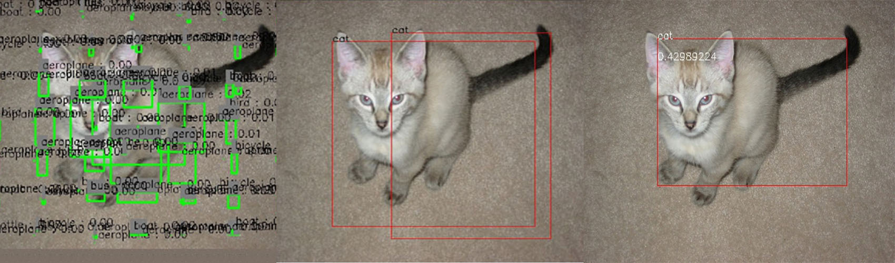
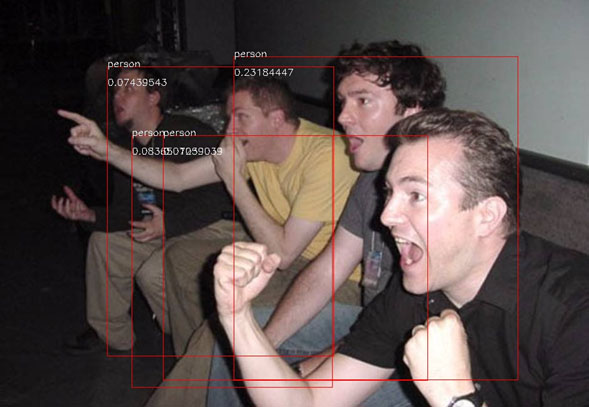

# ID
    106061514 許鈞棠  106061536 廖學煒
# Result
## ( 10~20 epochs / 200 epochs/ 1000 epochs)



## testing set: 1000epochs



    
# What kind of models you have tried and how did they work.
    1. Mask RCNN:
   __https://github.com/matterport/Mask_RCNN__<br>
        # The model outputs both the bounding boxes and the segmentaion region of the objects
        >high accuracy
        Problems:
        1.The backbone model depends on the pretrain models RESNET_50/101, which is not allowed in the 
        competition unless we train it from scratch. In consideration of our two weeks time limitation, 
        this approach seems to be infeasible.
        2.The code of train + model is huge (more than 4000 line), which is hard to trace and debug.
        I give up this model for the sake of time limitation.
    2. Yolo tiny net:
         Advantage:
         >train fast , low memory usage, code is similar to the course slide except the model part
         Problems:
         The model reach the bottle neck after 12 hours of training
         > It could barely pass benchmark 60 in our competition
    2. Yolo net:
         Advantage:
         > good accuracy (slightly inferior to RCNN)
         > The loss function is already provided by TA
         > The model strike a balance between performance ,training time and memory usage
         > Fast prediction speed : about 60X faster than RCNN which saves alot of time of running test image 
         > The model requires only 4G GPU memory while training on small batch size (16)
         > No backbone model required
         Potential problem:
         Training might take a long time (according to the paper, they pretrain their model on coco net and take about 
         one week to reach marvelous result). 
        After 2-3 days of training, this model passed benchmark 80 in this comepitition 
# Anything you've done and want to tell us.
    Prediction thresholding
        >If the classification accuracy isn't high enough, the best choose of confidence score will fall at 0.1~0.2.
        After the accuracy is high enough (after 3~5 days training), I'll set the threshold to zero to reach the highest
        mAP.
    Hardware:
        1080 Ti 11G ram
    Training Epochs:
        About 1000~1500 will give nice result
    Preprocessing:
        Normalize pixel value to -1~1 by calculating pixel/ 255.0 * 2 - 1
        resize to 448x448
# What problems you occured and how did you solve them.
    1.Importance of initial variable choosing
        Frankly speaking, the yolo model performs miserably (mAP<0.05) on my first attempt of training.
        After few days of debugging and code reading, I found that some output neurons has already died 
        and the gradient only come from other neurons with large output value.
        
        In the initial stage of training, the prediction width and height were ridiculously huge( > 1e16).
        As far as I'm concerned, this is the most crucial trap while training the yolo net:
        > large prediction output is tantamount to large x,y,w,h predict value. Providing that the prediction bounding
        boxes' size and position are far away from the ground truths, the iou could always be zero.
        Since the class loss and object/non object loss depends on the iou confidence score, the model is impossible
        to improve if iou is always zero.
        
        Consequently, I deleted my fine-tuned trash model and carefully chose the initial variables
        of the neurons. Surprisingly, the model converge pretty fast if the initial variable is chosen properly.
        In this case, I used truncate norm (mean = 0, std = 0.05) to generate the initial variable and set the bias
        to all zeros.
        A proper size of initial variable could save your model alot of time to converge and even provides your model 
        from gradient exxplosion
    2. Switch from SGD optimizer to Adam 
        Tensorflow might report that some variables not found while restoring the model so you're not able to load it.
        In this case, you have to initialize uninitialized variables.
        See TrainModel code's initialize_uninitialized_vars() function for more details and the example code below to
        find out how it works.
    3.Experiment: COCO dataset
        I attempted to use COCO dataset to train my model. However, I misunderstood that this dataset has only one
        bounding box for each image (after competition I found that they separate each bounding box of single image
        into different json cells)
        So I used a "defective" dataset to train my model and the result is horrible.
        After 5 hours of training with the coco dataset inserted, my model predicts a lots of "person" class. This 
        shows that the dataset without highlighting all objects could lead to undesirable result.
        Anyway, my model is enough to go on with the competition even COCO dataset is not applied

# Train + Model code


```python
# 
# python tools/YOLO_small_tf.py -c conf/train_small.cfg
ver = 14000
my_pretrain_path = './models/train/new'+str(ver)+'.ckpt'

is_save = True
save_name = '/new'+str(ver+1000)+'.ckpt'
import numpy as np
import tensorflow as tf
import cv2
import time
import sys
from datetime import datetime


sys.path.append('./')

import yolo
from yolo.utils.process_config import process_config
from optparse import OptionParser
        

class YOLO_TF:
    debug = []
    fromfile = None
    tofile_img = 'test/output.jpg'
    tofile_txt = 'test/output.txt'
    imshow = True
    filewrite_img = False
    filewrite_txt = False
    disp_console = True
    # weights_file = './models/train/model_small.ckpt'
    weights_file =  None
    
    alpha = 0.1
    threshold = 0.02 #confidence thres
    iou_threshold = 0.5
    num_class = 20
    num_box = 2
    grid_size = 7
    classes =  ["aeroplane", "bicycle", "bird", "boat", "bottle", "bus", "car", "cat", "chair", "cow", "diningtable", "dog", "horse", "motorbike", "person", "pottedplant", "sheep", "sofa", "train","tvmonitor"]

    w_img = 640
    h_img = 480

    def __init__(self,argvs = []):
        # self.argv_parser(argvs)

        parser = OptionParser()
        parser.add_option("-c", "--conf", dest="configure",  
                          help="configure filename")
        (options, args) = parser.parse_args() 
        if options.configure:
          conf_file = str(options.configure)
          print('config loaded')
        else:
          print('please specify --conf configure filename')
          exit(0)
        self.common_params, self.dataset_params,self.net_params, self.solver_params = process_config(conf_file)
        print(self.common_params)
        print(self.dataset_params)
        print(self.net_params)
        print(self.solver_params)
        self.image_size = int(self.common_params['image_size'])
        self.batch_size = int(self.common_params['batch_size'])
        self.cell_size = int(self.net_params['cell_size'])
        self.boxes_per_cell = int(self.net_params['boxes_per_cell'])
        self.num_classes = int(self.common_params['num_classes'])
        self.object_scale = float(self.net_params['object_scale'])
        self.noobject_scale = float(self.net_params['noobject_scale'])
        self.class_scale = float(self.net_params['class_scale'])
        self.coord_scale = float(self.net_params['coord_scale'])
        self.max_objects = int(self.common_params['max_objects_per_image'])
        self.max_iterators = int(self.solver_params['max_iterators'])
        self.learning_rate = float(self.solver_params['learning_rate'])
        self.moment = float(self.solver_params['moment'])
        self.train_dir = self.solver_params['train_dir']
        self.pretrain_path = my_pretrain_path
        self.build_networks()
        # self.fromfile ='./cat.jpg'
        if self.fromfile is not None: self.detect_from_file(self.fromfile)

    def initialize_uninitialized_vars(self,sess):
        from itertools import compress
        global_vars = tf.global_variables()
        is_not_initialized = sess.run([~(tf.is_variable_initialized(var)) \
                                       for var in global_vars])
        not_initialized_vars = list(compress(global_vars, is_not_initialized))

        if len(not_initialized_vars):
            sess.run(tf.variables_initializer(not_initialized_vars))
    def build_networks(self):
        if self.disp_console : print("Building YOLO_small graph...")
        self.x = tf.placeholder('float32',[None,448,448,3])
        self.labels = tf.placeholder(tf.float32, (self.batch_size, self.max_objects, 5))
        self.objects_num = tf.placeholder(tf.int32, (self.batch_size))
        # self.schedule_lr = tf.placeholder(tf.float32)
        
        self.conv_1 = self.conv_layer(1,self.x,64,7,2)
        self.pool_2 = self.pooling_layer(2,self.conv_1,2,2)
        self.conv_3 = self.conv_layer(3,self.pool_2,192,3,1)
        self.pool_4 = self.pooling_layer(4,self.conv_3,2,2)
        self.conv_5 = self.conv_layer(5,self.pool_4,128,1,1)
        self.conv_6 = self.conv_layer(6,self.conv_5,256,3,1)
        self.conv_7 = self.conv_layer(7,self.conv_6,256,1,1)
        self.conv_8 = self.conv_layer(8,self.conv_7,512,3,1)
        self.pool_9 = self.pooling_layer(9,self.conv_8,2,2)
        self.conv_10 = self.conv_layer(10,self.pool_9,256,1,1)
        self.conv_11 = self.conv_layer(11,self.conv_10,512,3,1)
        self.conv_12 = self.conv_layer(12,self.conv_11,256,1,1)
        self.conv_13 = self.conv_layer(13,self.conv_12,512,3,1)
        self.conv_14 = self.conv_layer(14,self.conv_13,256,1,1)
        self.conv_15 = self.conv_layer(15,self.conv_14,512,3,1)
        self.conv_16 = self.conv_layer(16,self.conv_15,256,1,1)
        self.conv_17 = self.conv_layer(17,self.conv_16,512,3,1)
        self.conv_18 = self.conv_layer(18,self.conv_17,512,1,1)
        self.conv_19 = self.conv_layer(19,self.conv_18,1024,3,1)
        self.pool_20 = self.pooling_layer(20,self.conv_19,2,2)
        self.conv_21 = self.conv_layer(21,self.pool_20,512,1,1)
        self.conv_22 = self.conv_layer(22,self.conv_21,1024,3,1)
        self.conv_23 = self.conv_layer(23,self.conv_22,512,1,1)
        self.conv_24 = self.conv_layer(24,self.conv_23,1024,3,1)
        self.conv_25 = self.conv_layer(25,self.conv_24,1024,3,1)
        self.conv_26 = self.conv_layer(26,self.conv_25,1024,3,2)
        self.conv_27 = self.conv_layer(27,self.conv_26,1024,3,1)
        self.conv_28 = self.conv_layer(28,self.conv_27,1024,3,1)
        self.fc_29 = self.fc_layer(29,self.conv_28,512,flat=True,linear=False)

        self.fc_30 = self.fc_layer(30,self.fc_29,4096,flat=False,linear=False)
        #skip dropout_31
        self.fc_32 = self.fc_layer(32,self.fc_30,1470,flat=False,linear=True)


        n1 = self.cell_size * self.cell_size * self.num_classes
        n2 = n1 + self.cell_size * self.cell_size * self.boxes_per_cell
        class_probs = tf.reshape(self.fc_32[:, 0:n1], (-1, 7,7,20))
        scales = tf.reshape(self.fc_32[:, n1:n2], (-1, 7,7,2))
        boxes = tf.reshape(self.fc_32[:, n2:], (-1,7, 7, 2*4))

        self.predicts   = tf.concat([class_probs, scales, boxes], 3)


        # predicts = self.interpret_output(self.fc_32[0])
        self.loss,self.debug = self.yolo_loss(self.predicts ,self.labels,self.objects_num)


        config = tf.ConfigProto()
        config.gpu_options.per_process_gpu_memory_fraction = 0.5
        self.sess = tf.Session(config = config)

        optimizer = tf.train.AdamOptimizer(self.learning_rate, self.moment,epsilon = 1.0)
        
        # optimizer = tf.train.GradientDescentOptimizer(self.learning_rate)
        
        # optimizer = tf.train.GradientDescentOptimizer(self.schedule_lr)
        self.train_op = optimizer.minimize(self.loss)

        self.sess.run( tf.global_variables_initializer())

        self.saver = tf.train.Saver()
        
        self.saver.restore(self.sess, self.pretrain_path)

        
        # self.initialize_uninitialized_vars(self.sess)
        


    def conv_layer(self,idx,inputs,filters,size,stride):
        channels = inputs.get_shape()[3]
        weight = tf.Variable(tf.truncated_normal([size,size,int(channels),filters],mean = 0.0000,stddev=0.05))
        biases = tf.Variable(tf.constant(0.000, shape=[filters]))

        pad_size = size//2
        pad_mat = np.array([[0,0],[pad_size,pad_size],[pad_size,pad_size],[0,0]])
        inputs_pad = tf.pad(inputs,pad_mat)

        conv = tf.nn.conv2d(inputs_pad, weight, strides=[1, stride, stride, 1], padding='VALID',name=str(idx)+'_conv')  
        conv_biased = tf.add(conv,biases,name=str(idx)+'_conv_biased')  
        if self.disp_console : print('    Layer  %d : Type = Conv, Size = %d * %d, Stride = %d, Filters = %d, Input channels = %d' % (idx,size,size,stride,filters,int(channels)))
        return tf.maximum(self.alpha*conv_biased,conv_biased,name=str(idx)+'_leaky_relu')

    def pooling_layer(self,idx,inputs,size,stride):
        if self.disp_console : print('    Layer  %d : Type = Pool, Size = %d * %d, Stride = %d' % (idx,size,size,stride))
        return tf.nn.max_pool(inputs, ksize=[1, size, size, 1],strides=[1, stride, stride, 1], padding='SAME',name=str(idx)+'_pool')

    def fc_layer(self,idx,inputs,hiddens,flat = False,linear = False):
        input_shape = inputs.get_shape().as_list()      
        if flat:
            dim = input_shape[1]*input_shape[2]*input_shape[3]
            inputs_transposed = tf.transpose(inputs,(0,3,1,2))
            inputs_processed = tf.reshape(inputs_transposed, [-1,dim])
        else:
            dim = input_shape[1]
            inputs_processed = inputs
        weight = tf.Variable(tf.truncated_normal([dim,hiddens],mean = 0.000, stddev=0.01))
        biases = tf.Variable(tf.constant(0.00, shape=[hiddens])) 
        if self.disp_console : print('    Layer  %d : Type = Full, Hidden = %d, Input dimension = %d, Flat = %d, Activation = %d' % (idx,hiddens,int(dim),int(flat),1-int(linear)))
        if linear : return tf.add(tf.matmul(inputs_processed,weight),biases,name=str(idx)+'_fc')
        ip = tf.add(tf.matmul(inputs_processed,weight),biases)


        return tf.maximum(self.alpha*ip,ip,name=str(idx)+'_fc')
    def training(self): #TODO add training function!

        print(' model exist:',self.pretrain_path)
        # except:print('model not found')
        print('dataset loaded')


        dataset = eval(self.dataset_params['name'])(self.common_params, self.dataset_params)

        
        # np_images, np_labels, np_objects_num = dataset.batch()
        # print(np_labels)
        for step in range(1,self.max_iterators):
            start_time = time.time()
            np_images, np_labels, np_objects_num = dataset.batch()


            _,loss_value,debug = self.sess.run([self.train_op,self.loss,self.debug],feed_dict={self.x: np_images,
                                                                            self.labels:np_labels,
                                                                            self.objects_num:np_objects_num})
            # print(debug)
            duration = time.time() - start_time
            assert not np.isnan(loss_value), 'Model diverged with loss = NaN'

            if step % 10 == 0:
                num_examples_per_step = self.batch_size
                examples_per_sec = num_examples_per_step / duration
                sec_per_batch = float(duration)

                format_str = ('%s: step %d, loss = %.2f (%.1f examples/sec; %.3f '
                              'sec/batch)')
                print(debug)
                print (format_str % (datetime.now(), step, loss_value,
                                     examples_per_sec, sec_per_batch))

            sys.stdout.flush()
            if step % 1200 == 0:
                if is_save:
                    self.saver.save(self.sess, self.train_dir + save_name)
                    print('save to',save_name)


        #calculate loss
    def yolo_loss(self, predicts, labels, objects_num):
        """
        calculate loss
        Args:
          predict: 3-D tensor [cell_size, cell_size, 5 * boxes_per_cell]
          labels : [max_objects, 5]  (x_center, y_center, w, h, class)
        """
        """Add Loss to all the trainable variables
          Args:
          predicts: 4-D tensor [batch_size, cell_size, cell_size, 5 * boxes_per_cell]
          ===> (num_classes, boxes_per_cell, 4 * boxes_per_cell)
          labels  : 3-D tensor of [batch_size, max_objects, 5]
          objects_num: 1-D tensor [batch_size]
        """
        def condition(num, object_num, loss, predict, label, nilboy):
            """
            if num < object_num
            """
            return num < object_num
        
        class_loss = tf.constant(0, tf.float32)
        object_loss = tf.constant(0, tf.float32)
        noobject_loss = tf.constant(0, tf.float32)
        coord_loss = tf.constant(0, tf.float32)
        loss = [0, 0, 0, 0]
        for i in range(self.batch_size):
            predict = predicts[i, :, :, :]
            label = labels[i, :, :]
            object_num = objects_num[i]

            nilboy = tf.ones([7,7,2])
            # nilboy = tf.ones([])
            
            tuple_results = tf.while_loop(condition, self.losses_calculation, 
                                          [tf.constant(0), object_num, 
                                           [class_loss, object_loss, noobject_loss, coord_loss], 
                                           predict, label, nilboy])

            for j in range(4):
                loss[j] = loss[j] + tuple_results[2][j]
            # nilboy = tuple_results[5]

        tf.add_to_collection('losses', (loss[0] + loss[1] + loss[2] + loss[3])/self.batch_size)

        tf.summary.scalar('class_loss', loss[0]/self.batch_size)
        tf.summary.scalar('object_loss', loss[1]/self.batch_size)
        tf.summary.scalar('noobject_loss', loss[2]/self.batch_size)
        tf.summary.scalar('coord_loss', loss[3]/self.batch_size)
        tf.summary.scalar('weight_loss', tf.add_n(tf.get_collection('losses')) 
                          - (loss[0] + loss[1] + loss[2] + loss[3])/self.batch_size )

        nilboy = loss
        return tf.add_n(tf.get_collection('losses'), name='total_loss'), nilboy
    def losses_calculation(self, num, object_num, loss, predict, labels, nilboy):
        """
        calculate loss
        Args:
          predict: 3-D tensor [cell_size, cell_size, 5 * boxes_per_cell]
          labels : [max_objects, 5]  (x_center, y_center, w, h, class)
        """
        label = labels[num:num+1, :]
        label = tf.reshape(label, [-1])

        #calculate objects  tensor [CELL_SIZE, CELL_SIZE]
        min_x = (label[0] - label[2] / 2) / (self.image_size / self.cell_size)
        max_x = (label[0] + label[2] / 2) / (self.image_size / self.cell_size)

        min_y = (label[1] - label[3] / 2) / (self.image_size / self.cell_size)
        max_y = (label[1] + label[3] / 2) / (self.image_size / self.cell_size)

        min_x = tf.floor(min_x)
        min_y = tf.floor(min_y)

        max_x = tf.minimum(tf.ceil(max_x), self.cell_size)
        max_y = tf.minimum(tf.ceil(max_y), self.cell_size)

        temp = tf.cast(tf.stack([max_y - min_y, max_x - min_x]), dtype=tf.int32)
        objects = tf.ones(temp, tf.float32)

        temp = tf.cast(tf.stack([min_y, self.cell_size - max_y, min_x, self.cell_size - max_x]), tf.int32)
        temp = tf.reshape(temp, (2, 2))
        objects = tf.pad(objects, temp, "CONSTANT")

        #calculate objects  tensor [CELL_SIZE, CELL_SIZE]
        #calculate responsible tensor [CELL_SIZE, CELL_SIZE]
        center_x = label[0] / (self.image_size / self.cell_size)
        center_x = tf.floor(center_x)

        center_y = label[1] / (self.image_size / self.cell_size)
        center_y = tf.floor(center_y)

        response = tf.ones([1, 1], tf.float32)

        temp = tf.cast(tf.stack([center_y, self.cell_size - center_y - 1, 
                                 center_x, self.cell_size -center_x - 1]), 
                       tf.int32)
        self.tmp = tf.stack([center_y, self.cell_size - center_y - 1, 
                             center_x, self.cell_size -center_x - 1])
        temp = tf.reshape(temp, (2, 2))
        response = tf.pad(response, temp, "CONSTANT")
        #objects = response

        #calculate iou_predict_truth [CELL_SIZE, CELL_SIZE, BOXES_PER_CELL]
        predict_boxes = predict[:, :, self.num_classes + self.boxes_per_cell:]

        predict_boxes = tf.reshape(predict_boxes, [self.cell_size, 
                                                   self.cell_size, 
                                                   self.boxes_per_cell, 4])

        predict_boxes = predict_boxes * [self.image_size / self.cell_size, 
                                         self.image_size / self.cell_size, 
                                         self.image_size, self.image_size]

        base_boxes = np.zeros([self.cell_size, self.cell_size, 4])

        #for each cell
        for y in range(self.cell_size):
            for x in range(self.cell_size):
                
                base_boxes[y, x, :] = [self.image_size / self.cell_size * x, self.image_size / self.cell_size * y, 0, 0]
                
        base_boxes = np.tile(np.resize(base_boxes, [self.cell_size, self.cell_size, 1, 4]), [1, 1, self.boxes_per_cell, 1])

        #if there's no predict_box in that cell, then the base_boxes will be calcuated with label and got iou equals 0
        predict_boxes = base_boxes + predict_boxes

        iou_predict_truth = self.iou(predict_boxes, label[0:4])
        #calculate C [cell_size, cell_size, boxes_per_cell]
        C = iou_predict_truth * tf.reshape(response, [self.cell_size, self.cell_size, 1])

        #calculate I tensor [CELL_SIZE, CELL_SIZE, BOXES_PER_CELL]
        I = iou_predict_truth * tf.reshape(response, (self.cell_size, self.cell_size, 1))

        max_I = tf.reduce_max(I, 2, keep_dims=True)

        I = tf.cast((I >= max_I), tf.float32) * tf.reshape(response, (self.cell_size, self.cell_size, 1))

        #calculate no_I tensor [CELL_SIZE, CELL_SIZE, BOXES_PER_CELL]
        no_I = tf.ones_like(I, dtype=tf.float32) - I 


        p_C = predict[:, :, self.num_classes:self.num_classes + self.boxes_per_cell]

        #calculate truth x, y, sqrt_w, sqrt_h 0-D
        x = label[0]
        y = label[1]

        sqrt_w = tf.sqrt(tf.abs(label[2]))
        sqrt_h = tf.sqrt(tf.abs(label[3]))

        #calculate predict p_x, p_y, p_sqrt_w, p_sqrt_h 3-D [CELL_SIZE, CELL_SIZE, BOXES_PER_CELL]
        p_x = predict_boxes[:, :, :, 0]
        p_y = predict_boxes[:, :, :, 1]

        #p_sqrt_w = tf.sqrt(tf.abs(predict_boxes[:, :, :, 2])) * ((tf.cast(predict_boxes[:, :, :, 2] > 0, tf.float32) * 2) - 1)
        #p_sqrt_h = tf.sqrt(tf.abs(predict_boxes[:, :, :, 3])) * ((tf.cast(predict_boxes[:, :, :, 3] > 0, tf.float32) * 2) - 1)
        #p_sqrt_w = tf.sqrt(tf.maximum(0.0, predict_boxes[:, :, :, 2]))
        #p_sqrt_h = tf.sqrt(tf.maximum(0.0, predict_boxes[:, :, :, 3]))
        #p_sqrt_w = predict_boxes[:, :, :, 2]
        #p_sqrt_h = predict_boxes[:, :, :, 3]
        p_sqrt_w = tf.sqrt(tf.minimum(self.image_size * 1.0, tf.maximum(0.0, predict_boxes[:, :, :, 2])))
        p_sqrt_h = tf.sqrt(tf.minimum(self.image_size * 1.0, tf.maximum(0.0, predict_boxes[:, :, :, 3])))
        
        #calculate truth p 1-D tensor [NUM_CLASSES]
        P = tf.one_hot(tf.cast(label[4], tf.int32), self.num_classes, dtype=tf.float32)

        #calculate predict p_P 3-D tensor [CELL_SIZE, CELL_SIZE, NUM_CLASSES]
        p_P = predict[:, :, 0:self.num_classes]

        #class_loss
        class_loss = tf.nn.l2_loss(tf.reshape(objects, (self.cell_size, self.cell_size, 1)) * (p_P - P)) * self.class_scale
        #class_loss = tf.nn.l2_loss(tf.reshape(response, (self.cell_size, self.cell_size, 1)) * (p_P - P)) * self.class_scale

        #object_loss
        object_loss = tf.nn.l2_loss(I * (p_C - C)) * self.object_scale
        #object_loss = tf.nn.l2_loss(I * (p_C - (C + 1.0)/2.0)) * self.object_scale

        #noobject_loss
        #noobject_loss = tf.nn.l2_loss(no_I * (p_C - C)) * self.noobject_scale
        noobject_loss = tf.nn.l2_loss(no_I * (p_C)) * self.noobject_scale

        #coord_loss
        coord_loss = (tf.nn.l2_loss(I * (p_x - x)/(self.image_size/self.cell_size)) +
                     tf.nn.l2_loss(I * (p_y - y)/(self.image_size/self.cell_size)) +
                     tf.nn.l2_loss(I * (p_sqrt_w - sqrt_w))/ self.image_size +
                     tf.nn.l2_loss(I * (p_sqrt_h - sqrt_h))/self.image_size) * self.coord_scale

        nilboy = p_C

        return (num + 1, object_num, [loss[0] + class_loss, 
                                      loss[1] + object_loss, 
                                      loss[2] + noobject_loss,
                                      loss[3] + coord_loss], 
                predict, labels, nilboy)

    def detect_from_cvmat(self,img):
        s = time.time()
        self.h_img,self.w_img,_ = img.shape
        img_resized = cv2.resize(img, (448, 448))
        img_RGB = cv2.cvtColor(img_resized,cv2.COLOR_BGR2RGB)
        img_resized_np = np.asarray( img_RGB )
        inputs = np.zeros((1,448,448,3),dtype='float32')
        inputs[0] = (img_resized_np/255.0)*2.0-1.0
        in_dict = {self.x: inputs}
        net_output = self.sess.run(self.fc_32,feed_dict=in_dict)
        self.result = self.interpret_output(net_output[0])
        self.show_results(img,self.result)
        strtime = str(time.time()-s)
        if self.disp_console : print('Elapsed time : ' + strtime + ' secs' + '\n')

    def detect_from_file(self,filename):
        if self.disp_console : print('Detect from ' + filename)
        for i in range(len(filename)):
            img = cv2.imread(filename)
            self.detect_from_cvmat(img)

    def detect_from_crop_sample(self):
        self.w_img = 640
        self.h_img = 420
        f = np.array(open('person_crop.txt','r').readlines(),dtype='float32')
        inputs = np.zeros((1,448,448,3),dtype='float32')
        for c in range(3):
            for y in range(448):
                for x in range(448):
                    inputs[0,y,x,c] = f[c*448*448+y*448+x]

        in_dict = {self.x: inputs}
        net_output = self.sess.run(self.fc_32,feed_dict=in_dict)
        self.boxes, self.probs = self.interpret_output(net_output[0])
        img = cv2.imread('person.jpg')
        self.show_results(self.boxes,img)

    def interpret_output(self,output):
        probs = np.zeros((7,7,2,20))
        class_probs = tf.reshape(output[0:980],(7,7,20))
        scales = tf.reshape(output[980:1078],(7,7,2))
        boxes = tf.reshape(output[1078:],(7,7,2,4))

        offset = tf.transpose(np.reshape(np.array([np.arange(7)]*14),(2,7,7)),(1,2,0))
        offset = tf.cast(offset, tf.float32)
        
        boxes[:,:,:,0] += offset
        boxes[:,:,:,1] += np.transpose(offset,(1,0,2))
        boxes[:,:,:,0:2] = boxes[:,:,:,0:2] / 7.0
        boxes[:,:,:,2] = np.multiply(boxes[:,:,:,2],boxes[:,:,:,2])
        boxes[:,:,:,3] = np.multiply(boxes[:,:,:,3],boxes[:,:,:,3])
        
        boxes[:,:,:,0] *= self.w_img
        boxes[:,:,:,1] *= self.h_img
        boxes[:,:,:,2] *= self.w_img
        boxes[:,:,:,3] *= self.h_img

        for i in range(2):
            for j in range(20):
                probs[:,:,i,j] = np.multiply(class_probs[:,:,j],scales[:,:,i])

        filter_mat_probs = np.array(probs>=self.threshold,dtype='bool')
        filter_mat_boxes = np.nonzero(filter_mat_probs)
        boxes_filtered = boxes[filter_mat_boxes[0],filter_mat_boxes[1],filter_mat_boxes[2]]
        probs_filtered = probs[filter_mat_probs]
        classes_num_filtered = np.argmax(filter_mat_probs,axis=3)[filter_mat_boxes[0],filter_mat_boxes[1],filter_mat_boxes[2]] 

        argsort = np.array(np.argsort(probs_filtered))[::-1]
        boxes_filtered = boxes_filtered[argsort]
        probs_filtered = probs_filtered[argsort]
        classes_num_filtered = classes_num_filtered[argsort]
        
        for i in range(len(boxes_filtered)):
            if probs_filtered[i] == 0 : continue
            for j in range(i+1,len(boxes_filtered)):
                if self.iou(boxes_filtered[i],boxes_filtered[j]) > self.iou_threshold : 
                    probs_filtered[j] = 0.0
        
        filter_iou = np.array(probs_filtered>0.0,dtype='bool')
        boxes_filtered = boxes_filtered[filter_iou]
        probs_filtered = probs_filtered[filter_iou]
        classes_num_filtered = classes_num_filtered[filter_iou]

        result = []
        for i in range(len(boxes_filtered)):
            result.append([self.classes[classes_num_filtered[i]],boxes_filtered[i][0],boxes_filtered[i][1],boxes_filtered[i][2],boxes_filtered[i][3],probs_filtered[i]])

        return result

    def show_results(self,img,results):
        img_cp = img.copy()
        if self.filewrite_txt :
            ftxt = open(self.tofile_txt,'w')
        for i in range(len(results)):
            x = int(results[i][1])
            y = int(results[i][2])
            w = int(results[i][3])//2
            h = int(results[i][4])//2
            if self.disp_console : print('    class : ' + results[i][0] + ' , [x,y,w,h]=[' + str(x) + ',' + str(y) + ',' + str(int(results[i][3])) + ',' + str(int(results[i][4]))+'], Confidence = ' + str(results[i][5]))
            if self.filewrite_img or self.imshow:
                cv2.rectangle(img_cp,(x-w,y-h),(x+w,y+h),(0,255,0),2)
                cv2.rectangle(img_cp,(x-w,y-h-20),(x+w,y-h),(125,125,125),-1)
                cv2.putText(img_cp,results[i][0] + ' : %.2f' % results[i][5],(x-w+5,y-h-7),cv2.FONT_HERSHEY_SIMPLEX,0.5,(0,0,0),1)
            if self.filewrite_txt :             
                ftxt.write(results[i][0] + ',' + str(x) + ',' + str(y) + ',' + str(w) + ',' + str(h)+',' + str(results[i][5]) + '\n')
        if self.filewrite_img : 
            if self.disp_console : print('    image file writed : ' + self.tofile_img)
            cv2.imwrite(self.tofile_img,img_cp)         
        if self.imshow :
            cv2.imshow('YOLO_small detection',img_cp)
            cv2.waitKey(1)
        if self.filewrite_txt : 
            if self.disp_console : print('    txt file writed : ' + self.tofile_txt)
            ftxt.close()

    def iou(self, boxes1, boxes2):
        """calculate ious
        Args:
          boxes1: 4-D tensor [CELL_SIZE, CELL_SIZE, BOXES_PER_CELL, 4]  ====> (x_center, y_center, w, h)
          boxes2: 1-D tensor [4] ===> (x_center, y_center, w, h)
          
        Return:
          iou: 3-D tensor [CELL_SIZE, CELL_SIZE, BOXES_PER_CELL]
        """
        
        #boxes1 : [4(xmin, ymin, xmax, ymax), cell_size, cell_size, boxes_per_cell]
        boxes1 = tf.stack([boxes1[:, :, :, 0] - boxes1[:, :, :, 2] / 2, boxes1[:, :, :, 1] - boxes1[:, :, :, 3] / 2,
                          boxes1[:, :, :, 0] + boxes1[:, :, :, 2] / 2, boxes1[:, :, :, 1] + boxes1[:, :, :, 3] / 2])
        
        #boxes1 : [cell_size, cell_size, boxes_per_cell, 4(xmin, ymin, xmax, ymax)]
        boxes1 = tf.transpose(boxes1, [1, 2, 3, 0])

        boxes2 =  tf.stack([boxes2[0] - boxes2[2] / 2, boxes2[1] - boxes2[3] / 2,
                          boxes2[0] + boxes2[2] / 2, boxes2[1] + boxes2[3] / 2])

        #calculate the left up point of boxes' overlap area
        lu = tf.maximum(boxes1[:, :, :, 0:2], boxes2[0:2])
        #calculate the right down point of boxes overlap area
        rd = tf.minimum(boxes1[:, :, :, 2:], boxes2[2:])

        #intersection
        intersection = rd - lu 

        #the size of the intersection area
        inter_square = intersection[:, :, :, 0] * intersection[:, :, :, 1]
        
        mask = tf.cast(intersection[:, :, :, 0] > 0, tf.float32) * tf.cast(intersection[:, :, :, 1] > 0, tf.float32)

        #if intersection is negative, then the boxes don't overlap
        inter_square = mask * inter_square

        #calculate the boxs1 square and boxs2 square
        square1 = (boxes1[:, :, :, 2] - boxes1[:, :, :, 0]) * (boxes1[:, :, :, 3] - boxes1[:, :, :, 1])
        square2 = (boxes2[2] - boxes2[0]) * (boxes2[3] - boxes2[1])

        return inter_square/(square1 + square2 - inter_square + 1e-6)
def main(argvs):
    yolo = YOLO_TF(argvs)
    # cv2.waitKey(1000)
    yolo.training()


if __name__=='__main__':    
    main(sys.argv)

```

# prediction code


```python
 # python small_demo.py -fromfile './cat.jpg'
version = 14000
version = str(version)
evaluate_name = 'new'+version+'.ckpt'
fuji_mode = 'pascal'
thre = [0,2,4]
# fuji_mode = '000004.jpg'
import numpy as np
import tensorflow as tf
import cv2
import time
import sys

class YOLO_TF:
    fromfile = None
    tofile_img = 'test/output.jpg'
    tofile_txt = 'test/output.txt'
    imshow = True
    filewrite_img = False
    filewrite_txt = False
    disp_console = True
    weights_file = 'models/train/'+evaluate_name
    
    alpha = 0.1
    threshold = 0.12
    num_classes = 20
    iou_threshold = 0.5
    boxes_per_cell = 2
    cell_size = 7
    classes_name =  ["aeroplane", "bicycle", "bird", "boat", "bottle", "bus", "car", "cat", "chair", "cow", "diningtable", "dog", "horse", "motorbike", "person", "pottedplant", "sheep", "sofa", "train","tvmonitor"]
    img_dir = '/media/labhdd/VOCdevkit/VOC2007/JPEGImages/'
    w_img = 0
    h_img = 0
    max_boxs = 20

    def __init__(self,argvs = []):
        self.build_networks()
        if fuji_mode == 'pascal':
            self.fromfile = self.get_files_path()
            self.detect_and_write(self.fromfile)
        else:
            self.detect_from_file(fuji_mode)
        
    def get_files_path(self):
        test_img_files = open('pascal_voc_testing_data.txt')
        test_images = []
        import numpy as np
        for line in test_img_files:
            line = line.strip()
            ss = line.split(' ')
            test_images.append(ss[0])
        return test_images
    def interpret_output(self,output):
        probs = np.zeros((7,7,2,20))
        class_probs = np.reshape(output[0:980],(7,7,20))
        scales = np.reshape(output[980:1078],(7,7,2))
        boxes = np.reshape(output[1078:],(7,7,2,4))
        offset = np.transpose(np.reshape(np.array([np.arange(7)]*14),(2,7,7)),(1,2,0))

        boxes[:,:,:,0] += offset
        boxes[:,:,:,1] += np.transpose(offset,(1,0,2))
        boxes[:,:,:,0:2] = boxes[:,:,:,0:2] / 7.0
        boxes[:,:,:,2] = np.multiply(boxes[:,:,:,2],boxes[:,:,:,2])
        boxes[:,:,:,3] = np.multiply(boxes[:,:,:,3],boxes[:,:,:,3])
        
        boxes[:,:,:,0] *= self.w_img
        boxes[:,:,:,1] *= self.h_img
        boxes[:,:,:,2] *= self.w_img
        boxes[:,:,:,3] *= self.h_img

        for i in range(2):
            for j in range(20):
                probs[:,:,i,j] = np.multiply(class_probs[:,:,j],scales[:,:,i])

        filter_mat_probs = np.array(probs>=self.threshold,dtype='bool')
        filter_mat_boxes = np.nonzero(filter_mat_probs)
        boxes_filtered = boxes[filter_mat_boxes[0],filter_mat_boxes[1],filter_mat_boxes[2]]
        probs_filtered = probs[filter_mat_probs]
        classes_num_filtered = np.argmax(filter_mat_probs,axis=3)[filter_mat_boxes[0],filter_mat_boxes[1],filter_mat_boxes[2]] 

        argsort = np.array(np.argsort(probs_filtered))[::-1]
        boxes_filtered = boxes_filtered[argsort]
        probs_filtered = probs_filtered[argsort]
        classes_num_filtered = classes_num_filtered[argsort]
        
        for i in range(len(boxes_filtered)):
            if probs_filtered[i] == 0 : continue
            for j in range(i+1,len(boxes_filtered)):
                if self.iou(boxes_filtered[i],boxes_filtered[j]) > self.iou_threshold : 
                    probs_filtered[j] = 0.0
        
        filter_iou = np.array(probs_filtered>0.0,dtype='bool')
        boxes_filtered = boxes_filtered[filter_iou] #xywh
        probs_filtered = probs_filtered[filter_iou]
        classes_num_filtered = classes_num_filtered[filter_iou]

        result = []
        for i in range(len(boxes_filtered)):
            result.append([self.classes_name[classes_num_filtered[i]],boxes_filtered[i][0],boxes_filtered[i][1],boxes_filtered[i][2],boxes_filtered[i][3],probs_filtered[i]])

        return result
    def iou(self,box1,box2):
        tb = min(box1[0]+0.5*box1[2],box2[0]+0.5*box2[2])-max(box1[0]-0.5*box1[2],box2[0]-0.5*box2[2])
        lr = min(box1[1]+0.5*box1[3],box2[1]+0.5*box2[3])-max(box1[1]-0.5*box1[3],box2[1]-0.5*box2[3])
        if tb < 0 or lr < 0 : intersection = 0
        else : intersection =  tb*lr
        return intersection / (box1[2]*box1[3] + box2[2]*box2[3] - intersection)
    def build_networks(self):
        if self.disp_console : print("Building YOLO_small graph...")
        self.x = tf.placeholder('float32',[None,448,448,3])
        self.conv_1 = self.conv_layer(1,self.x,64,7,2)
        self.pool_2 = self.pooling_layer(2,self.conv_1,2,2)
        self.conv_3 = self.conv_layer(3,self.pool_2,192,3,1)
        self.pool_4 = self.pooling_layer(4,self.conv_3,2,2)
        self.conv_5 = self.conv_layer(5,self.pool_4,128,1,1)
        self.conv_6 = self.conv_layer(6,self.conv_5,256,3,1)
        self.conv_7 = self.conv_layer(7,self.conv_6,256,1,1)
        self.conv_8 = self.conv_layer(8,self.conv_7,512,3,1)
        self.pool_9 = self.pooling_layer(9,self.conv_8,2,2)
        self.conv_10 = self.conv_layer(10,self.pool_9,256,1,1)
        self.conv_11 = self.conv_layer(11,self.conv_10,512,3,1)
        self.conv_12 = self.conv_layer(12,self.conv_11,256,1,1)
        self.conv_13 = self.conv_layer(13,self.conv_12,512,3,1)
        self.conv_14 = self.conv_layer(14,self.conv_13,256,1,1)
        self.conv_15 = self.conv_layer(15,self.conv_14,512,3,1)
        self.conv_16 = self.conv_layer(16,self.conv_15,256,1,1)
        self.conv_17 = self.conv_layer(17,self.conv_16,512,3,1)
        self.conv_18 = self.conv_layer(18,self.conv_17,512,1,1)
        self.conv_19 = self.conv_layer(19,self.conv_18,1024,3,1)
        self.pool_20 = self.pooling_layer(20,self.conv_19,2,2)
        self.conv_21 = self.conv_layer(21,self.pool_20,512,1,1)
        self.conv_22 = self.conv_layer(22,self.conv_21,1024,3,1)
        self.conv_23 = self.conv_layer(23,self.conv_22,512,1,1)
        self.conv_24 = self.conv_layer(24,self.conv_23,1024,3,1)
        self.conv_25 = self.conv_layer(25,self.conv_24,1024,3,1)
        self.conv_26 = self.conv_layer(26,self.conv_25,1024,3,2)
        self.conv_27 = self.conv_layer(27,self.conv_26,1024,3,1)
        self.conv_28 = self.conv_layer(28,self.conv_27,1024,3,1)
        self.fc_29 = self.fc_layer(29,self.conv_28,512,flat=True,linear=False)
        self.fc_30 = self.fc_layer(30,self.fc_29,4096,flat=False,linear=False)
        #skip dropout_31
        self.fc_32 = self.fc_layer(32,self.fc_30,1470,flat=False,linear=True)

        n1 = self.cell_size * self.cell_size * self.num_classes
        n2 = n1 + self.cell_size * self.cell_size * self.boxes_per_cell
        class_probs = tf.reshape(self.fc_32[:, 0:n1], (-1, 7,7,20))
        scales = tf.reshape(self.fc_32[:, n1:n2], (-1, 7,7,2))
        boxes = tf.reshape(self.fc_32[:, n2:], (-1,7, 7, 2*4))
       
        self.predicts   = tf.concat([class_probs, scales, boxes], 3)

        self.sess = tf.Session()
        self.sess.run(tf.initialize_all_variables())
        self.saver = tf.train.Saver()
        # self.saver = tf.train.import_meta_graph(self.weights_file+'.meta')
        self.saver.restore(self.sess, self.weights_file)
        if self.disp_console : print("Loading complete!" + '\n')

    def conv_layer(self,idx,inputs,filters,size,stride):
        channels = inputs.get_shape()[3]
        weight = tf.Variable(tf.truncated_normal([size,size,int(channels),filters], stddev=0.1))
        biases = tf.Variable(tf.constant(0.1, shape=[filters]))

        pad_size = size//2
        pad_mat = np.array([[0,0],[pad_size,pad_size],[pad_size,pad_size],[0,0]])
        inputs_pad = tf.pad(inputs,pad_mat)

        conv = tf.nn.conv2d(inputs_pad, weight, strides=[1, stride, stride, 1], padding='VALID',name=str(idx)+'_conv')  
        conv_biased = tf.add(conv,biases,name=str(idx)+'_conv_biased')  
        if self.disp_console : print('    Layer  %d : Type = Conv, Size = %d * %d, Stride = %d, Filters = %d, Input channels = %d' % (idx,size,size,stride,filters,int(channels)))
        return tf.maximum(self.alpha*conv_biased,conv_biased,name=str(idx)+'_leaky_relu')

    def pooling_layer(self,idx,inputs,size,stride):
        if self.disp_console : print('    Layer  %d : Type = Pool, Size = %d * %d, Stride = %d' % (idx,size,size,stride))
        return tf.nn.max_pool(inputs, ksize=[1, size, size, 1],strides=[1, stride, stride, 1], padding='SAME',name=str(idx)+'_pool')

    def fc_layer(self,idx,inputs,hiddens,flat = False,linear = False):
        input_shape = inputs.get_shape().as_list()      
        if flat:
            dim = input_shape[1]*input_shape[2]*input_shape[3]
            inputs_transposed = tf.transpose(inputs,(0,3,1,2))
            inputs_processed = tf.reshape(inputs_transposed, [-1,dim])
        else:
            dim = input_shape[1]
            inputs_processed = inputs
        weight = tf.Variable(tf.truncated_normal([dim,hiddens], stddev=0.1))
        biases = tf.Variable(tf.constant(0.1, shape=[hiddens])) 
        if self.disp_console : print('    Layer  %d : Type = Full, Hidden = %d, Input dimension = %d, Flat = %d, Activation = %d' % (idx,hiddens,int(dim),int(flat),1-int(linear))  )
        if linear : return tf.add(tf.matmul(inputs_processed,weight),biases,name=str(idx)+'_fc')
        ip = tf.add(tf.matmul(inputs_processed,weight),biases)
        return tf.maximum(self.alpha*ip,ip,name=str(idx)+'_fc')
    def detect_from_file(self,filename):
        if self.disp_console : print('Detect from ' + filename)
        for i in range(1):
            img = cv2.imread(filename)
            self.detect_from_cvmat(img)
    def detect_and_write(self,file_lst):
       
        all_pred = []
        for name in file_lst:
            pred20 = []
            print('predict ',name)
            np_img = cv2.imread(self.img_dir+name)
            if np_img is None:
                raise Exception('load err:path not found',self.img_dir+name)
            img = np_img.copy()
            self.h_img,self.w_img,_ = img.shape
            
            resized_img = cv2.resize(np_img, (448, 448))
            np_img = cv2.cvtColor(resized_img, cv2.COLOR_BGR2RGB)
            np_img = np_img.astype(np.float32)
            np_img = np.reshape(np_img, (1, 448, 448, 3))
            np_img = np_img / 255.0 * 2 - 1

            np_predict = self.sess.run(self.predicts, feed_dict={self.x: np_img})
            xmin, ymin, xmax, ymax, classes_num,conf = self.process_predicts(np_predict)
                
            for i in range(len(xmin)):
                if (0<=xmin[i]<= self.w_img) and (0<=xmax[i]<= self.w_img) and (0<=ymin[i]<= self.h_img) and (0<=ymax[i]<= self.h_img):
                    pred20.append([int(xmin[i]),int(ymin[i]),int(xmax[i]),int(ymax[i]),classes_num[i],conf[i]])
            all_pred.append(pred20)

        with open('./out/'+version+'_'+str(thre[0])+'.txt','w') as f1,open('./out/'+version+'_'+str(thre[1])+'.txt','w') as f2,open('./out/'+version+'_'+str(thre[2])+'.txt','w') as f3:
            for imgidx,name in enumerate(file_lst):
                f1.write(name)
                f2.write(name)
                f3.write(name)
                for i in range(20):
                    xmin, ymin, xmax, ymax, classes_num,conf=all_pred[imgidx][i]
                    if i != 0:
                        if conf > (thre[0]*0.01):
                            f1.write(" %s %s %s %s %s %s" %(int(xmin),int(ymin),int(xmax),int(ymax),classes_num,conf))
                        else:
                            break
                        if conf > (thre[1]*0.01):
                            f2.write(" %s %s %s %s %s %s" %(int(xmin),int(ymin),int(xmax),int(ymax),classes_num,conf))
                        if conf > (thre[2]*0.01):
                            f3.write(" %s %s %s %s %s %s" %(int(xmin),int(ymin),int(xmax),int(ymax),classes_num,conf))

                    else:
                        f1.write(" %s %s %s %s %s %s" %(int(xmin),int(ymin),int(xmax),int(ymax),classes_num,conf))
                        f2.write(" %s %s %s %s %s %s" %(int(xmin),int(ymin),int(xmax),int(ymax),classes_num,conf))
                        f3.write(" %s %s %s %s %s %s" %(int(xmin),int(ymin),int(xmax),int(ymax),classes_num,conf))
                f1.write("\n")
                f2.write("\n")
                f3.write("\n")
                
    def detect_from_cvmat(self,np_img):
        s = time.time()

        img = np_img.copy()
        self.h_img,self.w_img,_ = img.shape
        
        resized_img = cv2.resize(np_img, (448, 448))
        np_img = cv2.cvtColor(resized_img, cv2.COLOR_BGR2RGB)
        np_img = np_img.astype(np.float32)
        np_img = np.reshape(np_img, (1, 448, 448, 3))
        np_img = np_img / 255.0 * 2 - 1
        
        np_predict = self.sess.run(self.predicts, feed_dict={self.x: np_img})
        fc_out = self.sess.run(self.fc_32, feed_dict={self.x: np_img})
        result = self.interpret_output(fc_out[0])
        self.out_ori_img(img,result)

        # print(result)
        # [x,y,w,h] = result[0][1:-1]
        # print('small:',x,y,x+w,y+h)

        # print(np_predict.shape)#(1,7,7,30)
        xmin, ymin, xmax, ymax, classes_num,conf = self.process_predicts(np_predict)

        
        # xmin_, ymin_, xmax_, ymax_, classes_num_,conf_ = self.process_predicts_TA(np_predict)
        # print('TA:',xmin_, ymin_, xmax_, ymax_)
        
        for i in range(len(xmin)):
            print('nilboy:',xmin[i], ymin[i], xmax[i], ymax[i],self.classes_name[int(classes_num[i])],conf[i])
            class_name = self.classes_name[classes_num[i]]
            cv2.rectangle(img, (int(xmin[i]), int(ymin[i])), (int(xmax[i]), int(ymax[i])), (0, 0, 255))
            # cv2.putText(resized_img, class_name, (int(xmin[i]), int(ymin[i])), 2, 1.5, (0, 0, 255))
            cv2.putText(img,class_name,(int(xmin[i]), int(ymin[i])),cv2.FONT_HERSHEY_SIMPLEX,0.5,(255,255,255),1)
            cv2.putText(img,str(conf[i]),(int(xmin[i]), int(ymin[i])+30),cv2.FONT_HERSHEY_SIMPLEX,0.5,(255,255,255),1)
            
        cv2.imshow('YOLO_small detection',resized_img)
        cv2.imwrite('out.jpg', img)
        # cv2.waitKey(10000)
    def out_ori_img(self,img,results):
        img_cp = img.copy()

        for i in range(len(results)):
            x = int(results[i][1])
            y = int(results[i][2])
            w = int(results[i][3])//2
            h = int(results[i][4])//2
            cv2.rectangle(img_cp,(x-w,y-h),(x+w,y+h),(0,255,0),2)
            cv2.rectangle(img_cp,(x-w,y-h-20),(x+w,y-h),(125,125,125),-1)
            cv2.putText(img_cp,results[i][0] + ' : %.2f' % results[i][5],(x-w+5,y-h-7),cv2.FONT_HERSHEY_SIMPLEX,0.5,(0,0,0),1)

        cv2.imwrite('./ori_cat.jpg',img_cp)         


    def process_predicts(self,predicts):
        # probs = np.zeros((7,7,2,20))
        # class_probs = np.reshape(output[0:980],(7,7,20))
        # scales = np.reshape(output[980:1078],(7,7,2))
        # boxes = np.reshape(output[1078:],(7,7,2,4))
        # offset = np.transpose(np.reshape(np.array([np.arange(7)]*14),(2,7,7)),(1,2,0))

        p_classes = predicts[0, :, :, 0:20]
        C = predicts[0, :, :, 20:22]
        coordinate = predicts[0, :, :, 22:]

        p_classes = np.reshape(p_classes, (7, 7, 1, 20))
        C = np.reshape(C, (7, 7, 2, 1))

        P = C * p_classes
        xmin =[]
        ymin = []

        xmax = []
        ymax = []
        class_num = []
        conf = []
        Psort = np.argsort(P.flatten())
        cur_thres = self.threshold
        for i in range(self.max_boxs):
            index = Psort[-(i+1)]
            tmp_conf = P.flatten()[index]
            # if index[3] == 4: #bottle
            #     tmp_conf *=10
            #out put at least one box is important
            # if tmp_conf < cur_thres and (i != 0):
            #     break

            index = np.unravel_index(index, P.shape)
            

            class_num.append(index[3])

            coordinate = np.reshape(coordinate, (7, 7, 2, 4))

            max_coordinate = coordinate[index[0], index[1], index[2], :]

            xcenter = max_coordinate[0]
            ycenter = max_coordinate[1]
            w = max_coordinate[2]
            h = max_coordinate[3]

            xcenter = (index[1] + xcenter) * (448/7.0)
            ycenter = (index[0] + ycenter) * (448/7.0)

            w = w * 448
            h = h * 448
            xmin_tmp = xcenter - w/2.0
            ymin_tmp = ycenter - h/2.0

            xmin.append(xmin_tmp)
            ymin.append(ymin_tmp)
            xmax.append(xmin_tmp + w)
            ymax.append(ymin_tmp + h)
            conf.append(tmp_conf)

        xmin = np.array(xmin)
        ymin = np.array(ymin)
        xmax = np.array(xmax)
        ymax = np.array(ymax)
        
        xmin *= (self.w_img/448.0)
        ymin *= (self.h_img/448.0)
        xmax *= (self.w_img/448.0)
        ymax *= (self.h_img/448.0)

        xmin = np.clip(xmin, 0, self.w_img-1)
        ymin = np.clip(ymin, 0, self.h_img-1)
        xmax = np.clip(xmax, 0, self.w_img-1)
        ymax = np.clip(ymax, 0, self.h_img-1)
        
        return xmin, ymin, xmax, ymax, class_num,conf
        
  
yolo = YOLO_TF()


```

# data loader


```python
"""DataSet  base class 
"""
class DataSet(object):
  """Base DataSet
  """
  def __init__(self, common_params, dataset_params):
    """
    common_params: A params dict 
    dataset_params: A params dict
    """
    raise NotImplementedError

  def batch(self):
    """Get batch
    """
    raise NotImplementedError
```


```python
from __future__ import absolute_import
from __future__ import division
from __future__ import print_function

import os
import math
import random
import cv2
import numpy as np
from queue import Queue 
from threading import Thread

from yolo.dataset.dataset import DataSet 

class TextDataSet(DataSet):
  """TextDataSet
  process text input file dataset 
  text file format:
    image_path xmin1 ymin1 xmax1 ymax1 class1 xmin2 ymin2 xmax2 ymax2 class2
  """

  def __init__(self, common_params, dataset_params):
    """
    Args:
      common_params: A dict
      dataset_params: A dict
    """
    #process params
    self.data_path = str(dataset_params['path'])
    self.width = int(common_params['image_size'])
    self.height = int(common_params['image_size'])
    self.batch_size = int(common_params['batch_size'])
    self.thread_num = int(dataset_params['thread_num'])
    self.max_objects = int(common_params['max_objects_per_image'])

    #record and image_label queue
    self.record_queue = Queue(maxsize=10000)
    self.image_label_queue = Queue(maxsize=512)

    self.record_list = []  

    # filling the record_list
    input_file = open(self.data_path, 'r')

    for line in input_file:
      line = line.strip()
      ss = line.split(' ')
      ss[1:] = [float(num) for num in ss[1:]]
      self.record_list.append(ss)

    self.record_point = 0
    self.record_number = len(self.record_list)

    self.num_batch_per_epoch = int(self.record_number / self.batch_size)

    t_record_producer = Thread(target=self.record_producer)
    t_record_producer.daemon = True 
    t_record_producer.start()

    for i in range(self.thread_num):
      t = Thread(target=self.record_customer)
      t.daemon = True
      t.start() 

  def record_producer(self):
    """record_queue's processor
    """
    while True:
      if self.record_point % self.record_number == 0:
        random.shuffle(self.record_list)
        self.record_point = 0
      self.record_queue.put(self.record_list[self.record_point])
      self.record_point += 1

  def record_process(self, record):
    """record process 
    Args: record 
    Returns:
      image: 3-D ndarray
      labels: 2-D list [self.max_objects, 5] (xcenter, ycenter, w, h, class_num)
      object_num:  total object number  int 
    """
    image = cv2.imread(record[0])
    image = cv2.cvtColor(image, cv2.COLOR_BGR2RGB)
    h = image.shape[0]
    w = image.shape[1]

    width_rate = self.width * 1.0 / w 
    height_rate = self.height * 1.0 / h 

    image = cv2.resize(image, (self.height, self.width))

    labels = [[0, 0, 0, 0, 0]] * self.max_objects
    i = 1
    object_num = 0
    while i < len(record):
      xmin = record[i]
      ymin = record[i + 1]
      xmax = record[i + 2]
      ymax = record[i + 3]
      class_num = record[i + 4]

      xcenter = (xmin + xmax) * 1.0 / 2 * width_rate
      ycenter = (ymin + ymax) * 1.0 / 2 * height_rate

      box_w = (xmax - xmin) * width_rate
      box_h = (ymax - ymin) * height_rate

      labels[object_num] = [xcenter, ycenter, box_w, box_h, class_num]
      object_num += 1
      i += 5
      if object_num >= self.max_objects:
        break
    return [image, labels, object_num]

  def record_customer(self):
    """record queue's customer 
    """
    while True:
      item = self.record_queue.get()
      out = self.record_process(item)
      self.image_label_queue.put(out)

  def batch(self):
    """get batch
    Returns:
      images: 4-D ndarray [batch_size, height, width, 3]
      labels: 3-D ndarray [batch_size, max_objects, 5]
      objects_num: 1-D ndarray [batch_size]
    """
    images = []
    labels = []
    objects_num = []
    for i in range(self.batch_size):
      image, label, object_num = self.image_label_queue.get()
      images.append(image)
      labels.append(label)
      objects_num.append(object_num)
    images = np.asarray(images, dtype=np.float32)
    images = images/255 * 2 - 1
    labels = np.asarray(labels, dtype=np.float32)
    objects_num = np.asarray(objects_num, dtype=np.int32)
    return images, labels, objects_num
```

# config


```python
[Common]
image_size: 448
batch_size: 16
num_classes: 20
max_objects_per_image: 20
[DataSet]
name: yolo.dataset.text_dataset.TextDataSet
path: data/pascal_voc_train.txt
thread_num: 5
[Net]
weight_decay: 0.0005
cell_size: 7
boxes_per_cell: 2
object_scale: 1
noobject_scale: 0.5
class_scale: 1
coord_scale: 5
[Solver]
learning_rate: 0.0000007
moment: 0.09
max_iterators: 150010
train_dir: models/train

```
